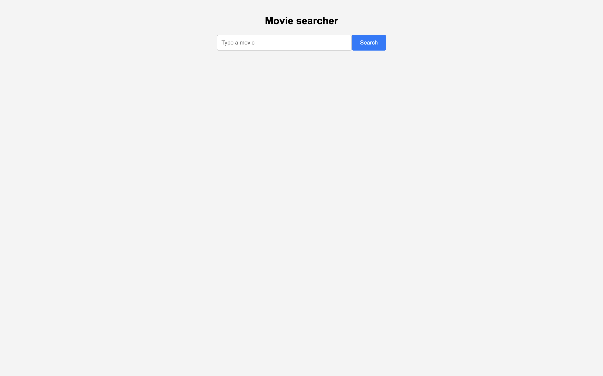
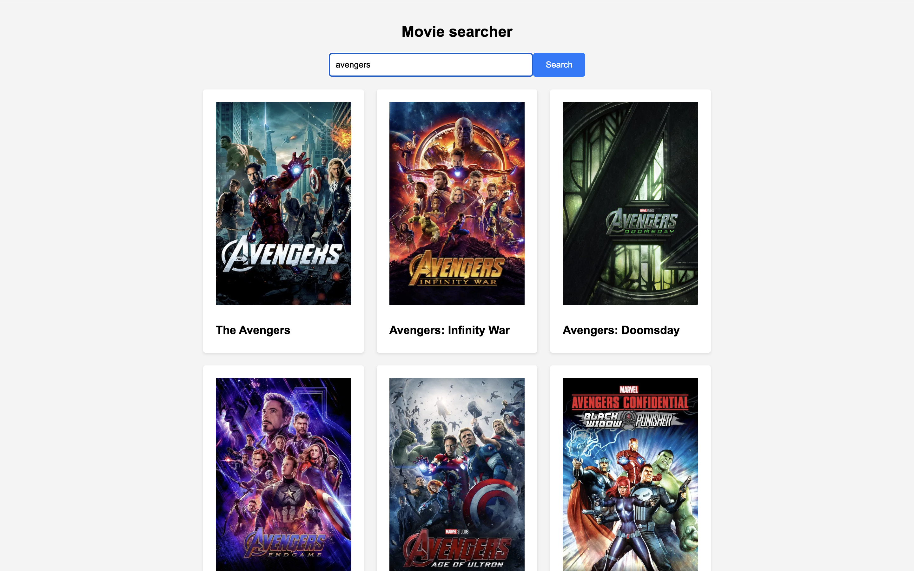

# 🎬 Movie Searcher

A clean, responsive movie search application built with **React 19** that lets users discover films using **The Movie Database (TMDB) API**. Type a title, hit search, and browse movie posters in a beautiful grid layout.

### 🔗 [Live Demo](https://movie-searcher-pearl.vercel.app/)

---

### Tech Stack


---

### Features

- 🔍 **Real-time Movie Search** — Query TMDB's vast database by movie title
- 🖼️ **Poster Grid** — Results displayed in a responsive card grid with movie posters
- ⚡ **Fast & Lightweight** — Minimal dependencies, built with Vite for instant HMR
- 📱 **Mobile Responsive** — Adaptive grid layout that works on all screen sizes
- 🔐 **Secure API Keys** — Environment variables via Vite's `import.meta.env`

---

### Project Structure

```
Movie-searcher/
├── index.html
├── package.json
├── vite.config.js
└── src/
    ├── main.jsx              # App entry point
    ├── MovieSearch.jsx        # Main search component (fetch, state, UI)
    └── styles/
        └── search.css         # Responsive styles with mobile breakpoints
```

---

### Getting Started

#### Prerequisites
- Node.js ≥ 18
- A free [TMDB API key](https://www.themoviedb.org/settings/api)

#### Installation

```bash
# Clone the repository
git clone https://github.com/JohnCard/Movie-searcher.git

# Navigate to the project
cd Movie-searcher

# Install dependencies
npm install

# Create environment file
echo "VITE_MOVIE_SEARCH=your_tmdb_api_key_here" > .env

# Start development server
npm run dev
```

#### Environment Variables

| Variable | Description |
|---|---|
| `VITE_MOVIE_SEARCH` | Your TMDB API Bearer token |

---

### Screenshots

| Search Interface | Movie Results |
|:-:|:-:|
|  |  |

---

### API Reference

This app uses the [TMDB Search API](https://developer.themoviedb.org/reference/search-movie):

```
GET https://api.themoviedb.org/3/search/movie?query={search_term}
```

Movie posters are loaded from TMDB's image CDN:
```
https://image.tmdb.org/t/p/original/lFx2i2pg1BoaD7grcpGDyHM1eML.jpg
```

